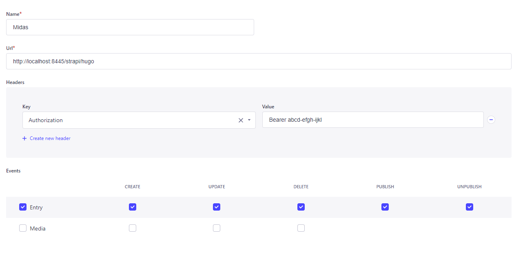

# Midas

[](https://github.com/kovansky/midas/actions/workflows/test.yml)
[](https://github.com/kovansky/midas/actions/workflows/build.yml)


## What am I?

Midas is an web application that allows to generate static websites using SSGs using data from headless CMS.

## How does it work?

Midas is listening for the webhooks from the "provider" - CMS - and then, depending on the payload, it modifies the
site (e.g. adds a new post) and regenerates it (builds).

## Features

- Listening to the changes from the headless CMS using the endpoint for the webhooks.
- Sanitizing and generating new data (post/page) for the site.
- Generating the static site using one of the supported SSGs.
- Deployment of the ready website to one of the cloud providers.

## Supported technologies

### Providers (CMS)

- [Strapi](https://strapi.io/)

### Receivers (Static site generators)

- [Hugo](https://gohugo.io)

### Deployment targets

- [AWS](https://aws.amazon.com/)
    - Files upload to [AWS S3](https://aws.amazon.com/s3/).
    - [CloudFront](https://aws.amazon.com/cloudfront/) distribution invalidation.

### Provider-receiver support matrix

|          | Strapi |
|----------|--------|
| **Hugo** | ✔      |

## Installation

### Pre-built binaries

You can find downloads in the [releases section on GitHub](https://github.com/kovansky/midas/releases).

### Install using go

You may want to install the app using go itself. To do that, type following command:

```shell
go install github.com/kovansky/midas/cmd/midasd@latest
```

## Usage

### Midas configuration

You need to create a configuration file (can be in your home directory). Config file path needs to be provided while
starting `midasd` webserver.

<details>
<summary>Sample configuration file</summary>

```json5
{
  // This is a address that the app will be listening on
  "addr": "127.0.0.1:8445",
  // You can paste the Rollbar token to receive internal errors reported there (https://rollbar.com/)
  "rollbarToken": "",
  // This is probably most important part of the config - here you specify where your static site code is
  "sites": {
    // We start with an API key, a.k.a. identifier of the site. In future the codes will be held in some database, not there
    "abcd-efgh-ijkl": {
      // Name of the site. May be passed to generator.
      "siteName": "Sample site",
      // Very important setting, specifies which SSG (receiver) is used. Required.
      "service": "hugo",
      // Where the site code lives. Should be absolute path. Required.
      "rootDir": "/home/kitten/hugo-site",
      // You can enable to build a site with draft posts along with the main site (in the separate dir). Default: false.
      "buildDrafts": false,
      // If you enable the option above ^, here you need to pass the URL at which the site will be available, so the generator can build URLs properly.
      "draftsUrl": "http://preview.hugo.local",
      // Here you can set where the static site will be generated (can be absolute or relative - then will be placed under rootDir).
      "outputSettings": {
        // Main site will be generated to this directory. Default: public
        "build": "public",
        // Site with drafts will be generated to this directory. Default: publicDrafts
        "draft": "publicDrafts"
      },
      // You can specify deployment configuration to upload built site to the cloud.
      "deployment": {
        // Self-explainatory. If the deployment is enabled.
        "enabled": true,
        // Name of the provider to use. Currently only AWS is supported.
        "target": "aws",
        // Target-specific settings.
        "aws": {
          // Name of the bucket to use for upload.
          "bucketName": "hugo-test",
          // AWS Access and secret keys.
          "accessKey": "AWSSAMPLEACCESSKEY",
          "secretKey": "AWSSAMPLESECRETKEY",
          // AWS S3 bucket region.
          "region": "eu-central-1",
          // If provided, all files in the distribution will be invalidated after deployment.
          "cloudfrontDistribution": "E3SABCD1234",
        }
      },
      // Same as the deployment above, using same config structure, but for drafts.
      "draftsDeployment": {},
      // Required. Midas keeps an id->filename mapping for created entries.
      "registry": {
        // Currently only jsonfile storage is supported.
        "type": "jsonfile",
        // Provide json filename where the mapping should be saved. Can be absolute or relative - then will be placed under site's rootDir 
        "location": "./midas-registry.json"
      },
      // List incoming types that should be treated as collections (multiple entries per type).
      "collectionTypes": {
        // ...here we are allowing "post" type as a collection type, because we will have many posts
        "post": {
          // We can choose the archetype used to generate content for this type.
          "archetypePath": "archetypes/default.md",
          // And specify the directory to which the entries will be saved.
          "outputDir": "content/posts/"
        }
      },
      // Same as above, but with single types (so type=one entry).
      "singleTypes": {
        "homepage": {
          // For single types a JSON file with entry data will be generated in the outputDir (named %typename%.json, i.e. homepage.json) with values passed through the HTML sanitizer.
          "outputDir": "data/cms/"
        }
      }
    }
    // Note, that types not listed in collectionTypes nor singleTypes will be ignored.
  }
}
```

</details>

### Start midas

After creating the configuration file you need to start the Midas. The main command is `midasd`. It takes two
arguments (optional):

- `config` - path to your config file. Default: `config.json` (in current directory).
- `env` - development or production. Used in rollbar logging. Default: production. Can also be set using MIDAS_ENV
  environmental variable.

So sample startup command could be:

```shell
midasd --config ~/midas.json --env development
```

## CMS configuration

### Strapi

For Strapi to send webhooks to Midas you need to head to the **Settings** in Strapi, then to **Webhooks**, and click **"
Create new webhook"** (or just
visit [https://your-strapi-installation.com/admin/settings/webhooks/create](http://localhost:1337/admin/settings/webhooks/create))
.

You can choose whatever name you want. In the URL you need to pass a Midas URL for the connection. It will have the
following form: `https://midas-installation.com/{{provider}}/{{receiver}}`. For example if you are connecting **Strapi**
and **Hugo**, the URL will be `https://midas-installation.com/strapi/hugo`.

Now go to the Headers and add the `Authorization` header with value `Bearer {{insert API key}}`,
i.e. `Bearer abcd-efgh-ijkl`.

In the Events part it is recommended to select all checkboxes for **Entry**. **Media** is currently not supported.

Whole Strapi settings should look like this:


### Creating archetypes

When creating archetypes for entries, you can use data from the Payload sent by the Provider. Most of the information
will be stored in two maps: one named `Entry` (with entry data, like values of the fields from CMS), and second
named `Metadata` with some generated data, like information if entry is published. Sample archetype for Strapi->Hugo
relation may look like this:

```html
---
title: "{{ index .Entry "Title" }}" # We read the title from one of the fields configured in CMS
date: {{ index .Metadata "createdAt" }} # We read the publication date from metadata
draft: {{ not (index .Metadata "published") }} # As well as the information if the post is published or not.
---

<h3>{{ index .Entry "Subtitle" }}</h3> <!-- We may for example include some subtitle -->
<div id="entry-content">
    {{ index .Entry "Content" }} <!-- And after all we include the main entry content -->
</div>
```

## Feature requests? Bugs?

You are welcome to [open an issue](https://github.com/kovansky/midas/issues/new).

## Contributing?

You are welcome to write new features, providers, receivers or deployment targets :)

## License

Project is released under GNU GPLv3. For more information, see LICENSE file.

## Author

Created and maintained by [F4 Developer (Stanisław Kowański)](https://www.f4dev.me)
